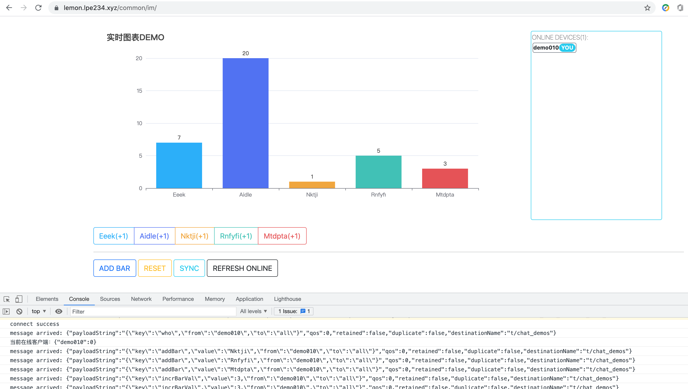

# Task-2-WEB

环信MQTT-实时图表Demo

---

活动地址：[https://www.imgeek.org/question/262748](https://www.imgeek.org/question/262748)

预览地址：[https://lemon.lpe234.xyz/common/im/](https://lemon.lpe234.xyz/common/im/)

---

简单实现协议：

```text
reset: 执行重置操作
incrBarVal: 增加Bar值, 参数: idx(索引值)
addBar: 增加Bar, 参数: barName(柱状图名称)
sync: 发起同步策略
syncResp: 同步处理, 参数: xdata, sdata
```

需要去环信官网申请MQTT应用。[https://www.easemob.com/product/mqtt](https://www.easemob.com/product/mqtt)

并在`main.js`中做相应设置，具体见代码`TODO:`注释描述。


预览图：


